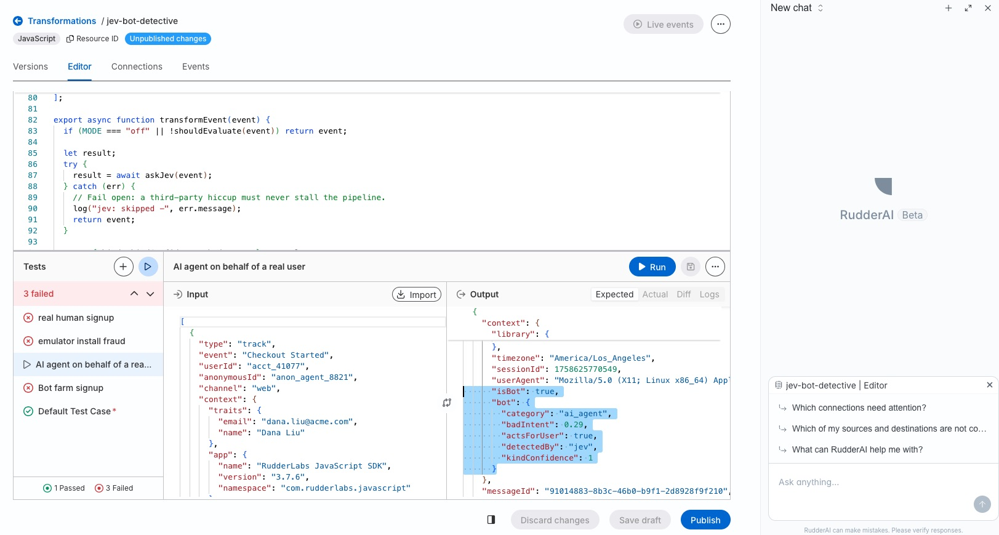

# Jev Bot Intelligence Layer for real-time event stream data

A real-time customer data pipeline transformation with "system 1" decision intelligence powered by [Jev](https://typesafe.ai).

Labels each high-stakes event before it reaches your warehouse or marketing/analytics/product tools **by classifying:**

1. **Who is behind it?** Human · AI agent · crawler · other automation
3. **Is it an abuse?** A confidence score from 0 to 1

## Who this is for

Data teams who need signup, login, checkout, and install events labeled before they reach analytics or the warehouse. Known bots can be caught by simple rules, but this layer classifies the rest so you can drop abuse, keep real-user AI agents, and tag the rest for review. Read [comparison with deterministic rules](#why-jev-for-bot-classification) for more details.

## Features

- Spot fake signups and fraud before they land in your tools
- Keep AI-agent checkouts that act for a real customer
- Clean bots out of DAU, funnels, and A/B tests
- See AI and search crawler traffic as its own kind
- Tag first, drop later - measure before you enforce

## What it adds to each evaluated event

| Field                        | Values                                                                                         | Meaning                            |
| ---------------------------- | ---------------------------------------------------------------------------------------------- | ---------------------------------- |
| `context.isBot`              | `true` / `false`                                                                               | `false` only when kind is `human`  |
| `context.bot.category`       | `human`, `ai_agent`, `ai_crawler`, `search_crawler`, `seo_tool`, `scraper`, `other_automation` | What produced the event            |
| `context.bot.badIntent`      | 0 to 1                                                                                         | Probability the event is abuse     |
| `context.bot.kindConfidence` | 0 to 1                                                                                         | How sure Jev is about the category |
| `context.bot.actsForUser`    | `true` / `false`                                                                               | A real person is behind it         |
| `context.bot.detectedBy`     | `"jev"`                                                                                        | Which layer tagged it              |

## Quick start

1. Fork this repo (this is an MIT license project, no restrictions)
2. Don't have your customer data pipeline set up? Set it up quickly with [RudderStack free account](https://app.rudderstack.com/signup?type=freetrial). Use webhook source and any database destination for quick testing.
3. Get the Jev api key from [Typesafe AI console](https://console.typesafe.ai/) and update `TYPESAFE_API_KEY` value in the [transformation code](./transformations/code/jev-bot-layer.js)
4. Either [create a JavaScript transformation manually](https://www.rudderstack.com/docs/transformations/overview/) and paste the [transformation code](./transformations/code/jev-bot-layer.js) OR set the repo secrets needed for [the GitHub Action included in this repo](./.github/workflows/deploy-transforms.yml) for automated deployment
5. Import `transformations/code/testevents.json` and run the cases (same panel as the screenshot above).
6. In the [transformation code](./transformations/code/jev-bot-layer.js), keep `MODE = "shadow"` until you trust the verdicts, then switch to `"enforce"`.

## Test cases

| #   | Scenario                                   | Expected                                              |
| --- | ------------------------------------------ | ----------------------------------------------------- |
| 1   | Bot farm signup in a real browser          | `human`, `badIntent` >= 0.8 (dropped in enforce mode) |
| 2   | AI agent checkout for a logged-in customer | `ai_agent`, `actsForUser: true`, low `badIntent`      |
| 3   | Android emulator install fraud             | `other_automation`, `badIntent` >= 0.8                |
| 4   | Real person signing up                     | `human`, low `badIntent`                              |

> [!WARNING]
> Jev is probabilistic, so `badIntent` and `kindConfidence` vary slightly between runs. Judge a test by the expected column, not exact decimals.

## Make it yours

- Edit `EVALUATE_EVENTS` to control which events are evaluated (and your cost).
- Tune `BAD_INTENT_THRESHOLD` using real traffic in shadow mode.
- Add your own user-agent rules at the top of `transformEvent`, e.g. the
[bot filter template](https://www.rudderstack.com/docs/transformations/templates/#filter-bot-traffic).

## FAQ

### Why Jev for bot classification

Rules ask "known bot?". Generally based on user-agent string.
That misses bot farms in real browsers, and blocks AI agents buying for real customers.
When agents have become the primary user, it is not a good idea to treat all bots the same.
With Jev, we are able to identify what `kind` of bot is it and whether it has a bad intent or not.

### What is Jev

[Jev](https://typesafe.ai) is TypeSafe AI's System One model. You send it context and fixed questions; it returns typed answers with probabilities (a choice from your list, or 0 to 1), not free text. This transformation asks what produced the event and how likely it is abuse. See the [Jev introduction](https://typesafe.ai/blog/introducing-system-one-models-and-jev).

### What is RudderStack

[RudderStack](https://www.rudderstack.com/) collects customer events data from all your apps, then sends them to your warehouse and tools. 

- Source code: [rudder-server](https://github.com/rudderlabs/rudder-server)
- Docs: [rudderstack.com/docs](https://www.rudderstack.com/docs/).

### What are RudderStack Transformations

A [transformation](https://www.rudderstack.com/docs/transformations/overview/) is JavaScript or Python that runs on each event in the pipeline before destinations receive it. This repo is one of them (`jev-bot-layer.js`): it calls Jev, writes the verdict onto the event, and in `enforce` mode can drop high `badIntent` events. More in the [transformations docs](https://www.rudderstack.com/docs/transformations/).

### How does this work with the deterministic Bot Management

Use [Bot Management](https://www.rudderstack.com/docs/data-governance/bot-management/) for known bots, and set it to **Forward events with a flag** so those events still reach this layer. Jev only runs on events that still need a decision.

## License
MIT
